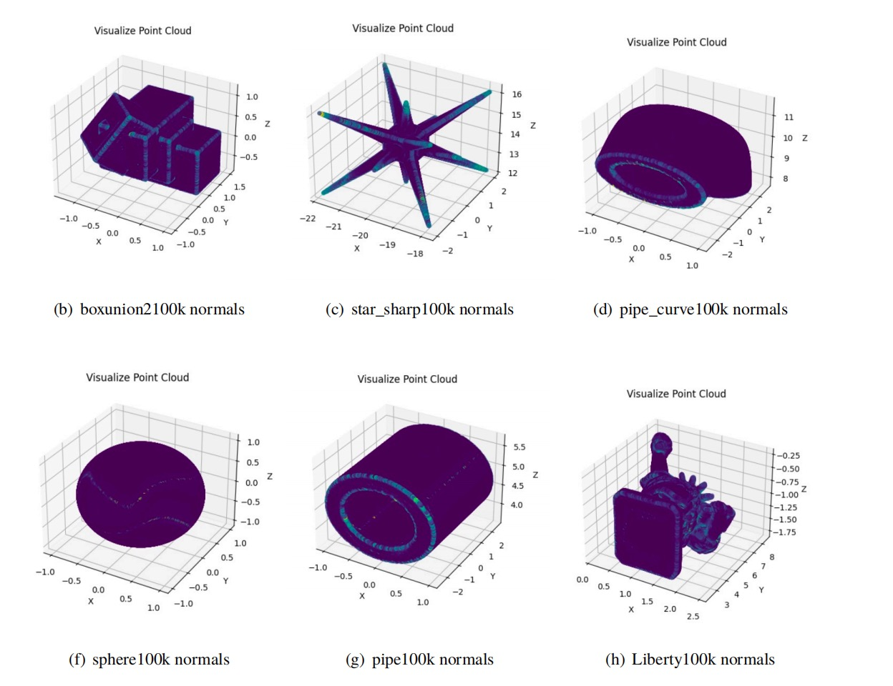

# myPCPNet
Use pytorch to replicate PCPNet. 
> Authors: Paul Guerrero, Yanir Kleiman, Maks Ovsjanikov, Niloy J. Mitra.
> 
Reproduction of paper: ["PCPNET Learning Local Shape Properties from Raw Point Clouds"](https://arxiv.org/abs/1710.04954)

# Implemented Features
- [x] replicate network architecture
- [x] replicate training process
- [x] visualize predict result
- [x] wandb

# Quick Start
1. Configure experimental parameters in config.yaml according to your needs.
2. download point clouds
   ``python pclouds/download_pclouds.py``	
3. train the network ``python main.py``	
4. eval``python eval_PCPNet.py``	
5. visualize ``python visualization.py``	

# the quantified error color temperature diagram

